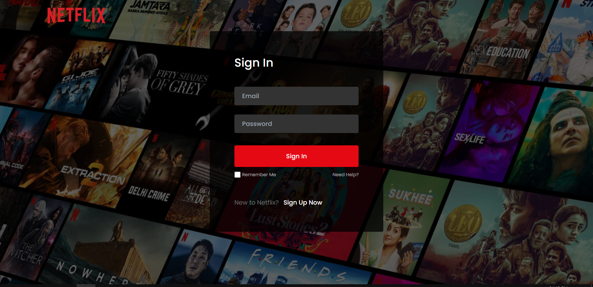
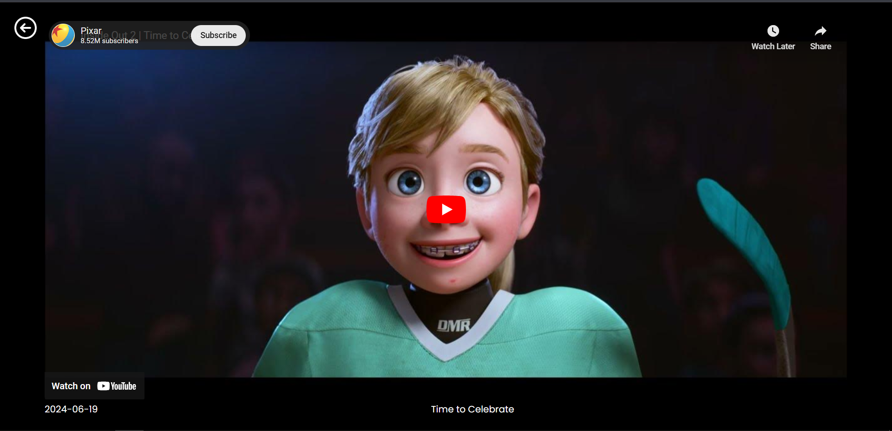

# NETFLIX Clone
A Netflix clone built using React, demonstrating the use of modern web technologies to create a functional and visually appealing web application similar to Netflix. This project is an educational exercise that replicates key features of the popular streaming service, providing users with a rich, engaging interface for browsing and discovering movies and TV shows.
#### Live Demo : https://netflix-beta-nine.vercel.app
## Table of Contents: 
- [Built With](#built-with)
- [Website Structure](#website-structure)
- [Installation](#installation)
## Built With:
- React + Vite
- React Router DOM
- TMDB API : For movie data and information
- Firebase : For authentication
- Tailwind : For styling
- React-Toastify
- Node + Express: For Backend
## Website Structure: 
- [Login Page](#login-page)
- [Home Page](#home-page)
- [Player Page](#player-page)
#### Login Page

#### Home Page

#### Player Page

## Installation
### Front-end Installation
1. Install the dependencies :  
 ```
 npm install
 ```
2. Define environment variable:'
```
// Create a firebase authentication project and define these varaiables in .env
const firebaseConfig =  {
	apiKey: VITE_API_KEY,
	authDomain: VITE_AUTH_DOMAIN,
	projectId: VITE_PROJECT_ID,
	storageBucket: VITE_STORAGE_BUCKET,
	messagingSenderId: VITE_MESSAGE_SENDER_ID,
	appId: VITE_APP_ID
}
``` 
3. Run development server : 
```
npm run dev
```
### Back-end Installation
1. Install the dependencies :  
 ```
 npm install
 ```
 2. Define environment variable:
```
PORT = 8000 // Example
TMDB_TOKEN = // Generated By creating account in TMDB Database
``` 
3.  Start the Server: 
```
npm start
```
---
Feel free to further modify and expand the content to better fit your project's specifics.
