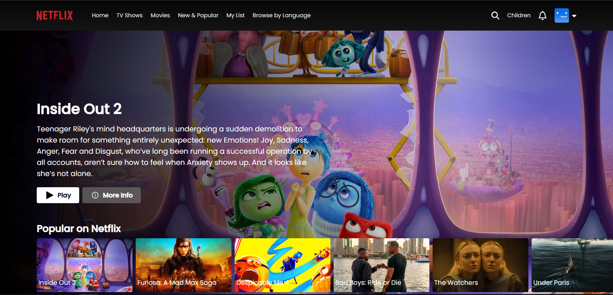

# NETFLIX Clone

A Netflix clone built using React, demonstrating the use of modern web technologies to create a functional and visually appealing web application similar to Netflix. This project is an educational exercise that replicates key features of the popular streaming service, providing users with a rich, engaging interface for browsing and discovering movies and TV shows.

## Built With:
- React + Vite
- React Router DOM
- TMDB API : For movie data and information
- Firebase : For authentication
- Tailwind : For styling
- React-Toastify
- Node + Express: For Backend

## Website Structure: 
- [Login Page](#Login-page)
- [Home Page](#Home-page)
- [Player Page](#Player-page)

### Login Page

### Home Page

### Player Page

## Installation
